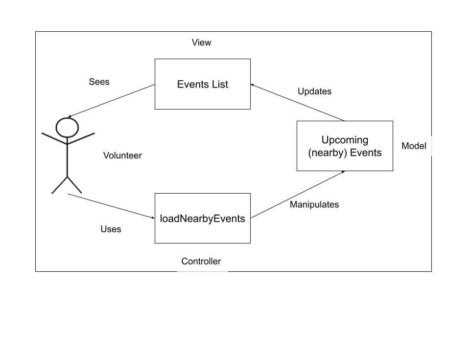

# Lab Report: Continuous Integration
___
**Course:** CIS 411, Spring 2021  
**Instructor(s):** [Trevor Bunch](https://github.com/trevordbunch)  
**Name:** Noah Calisti  
**GitHub Handle:** noahcal11  
**Repository:** [My Forked Repository](https://github.com/noahcal11/cis411_lab2_arch)  
**Collaborators:** 
___

# Step 1: Confirm Lab Setup
- [X] I have forked the repository and created my lab report
- [X] I have reviewed the [lecture / discsussion](../assets/04p1_SolutionArchitectures.pdf) on architecture patterns.
- [ ] If I'm collaborating on this project, I have included their handles on the report and confirm that my report is informed, but not copied from my collaborators.

# Step 2: Analyze the Proposal
Serve Central is a web/mobile application that aims to centralize all local service/volunteer opportunities. Using their account, users can find and register for any events they'd like.

## Step 2.1 Representative Use Cases  

| Use Case #1 | |
|---|---|
| Title | Event Registration - Volunteer |
| Description | **As a ServeCentral user, I want to register for a local service event.** |
| Steps | 1. An individual navigates to the ServeCentral website, finds an event they like, and clicks `Sign up`.   2. The site displays any additional information or options (safety, items to bring, role selection) and the user selects options if necessary.   3. The site displays a confirmation message and adds the event to the user's events section.|
| Primary Actor | Volunteer |
| Preconditions | The user has an activated ServeCentral account. |
| Postconditions | 1. The user is registered for the event   2. The event is in the user's calendar in the app/website |

| Use Case #2 | |
|---|---|
| Title | Event Posting - Service Agencies |
| Description | **As a service agency, I want to post an event on ServeCentral to find the appropriate volunteers** |
| Steps | 1. Someone from the agency navigates to the ServeCentral website and clicks the `Post New Event` button.   2. The agency worker fills out basic information about the event (title, location, description, desired number of workers).   3. The worker optionally enters additional questions they want to ask volunteers before signing up.   4. The worker confirms details and posts the event. |
| Primary Actor | Service Agency |
| Preconditions | The service agency has a ServeCentral service account |
| Postconditions | The event is listed on ServeCentral at the correct geographic location |

## Step 2.2 Define the MVC Components

| Model | View | Controller |
|---|---|---|
| Upcoming Events | Events List | loadNearbyEvents |
| Users | Account Page | showProfile |
| Service Agencies | Search Agencies | showAgencies |
| Previous Events | My Service History | getUserHistory |

## Step 2.3 Diagram a Use Case in Architectural Terms
Diagram of a user opening the events page to view nearby events

# Step 3: Enhancing an Architecture

## Step 3.1 Architecture Change Proposal
A broker architecture could be a good choice for the ServeCentral because it provides a centralized component that acts as an intermediary between different services and facilitates communication between them.

In this scenario, the broker component can be responsible for receiving volunteer opportunities from third-party services and distributing them to the relevant services within ServeCentral. The broker component can also be used to manage the organization-specific interfaces, ensuring that data is properly routed to the correct services for processing.

One advantage of using a broker architecture is that it allows for decoupled communication between services, making it easier to add or remove services without affecting the rest of the system. The broker component can also act as a single point of entry, which can help to improve security and simplify access control.

One potential issue with using a broker architecture is that the broker component can become a bottleneck if it is not properly optimized, leading to decreased performance and scalability. Additionally, if the broker component fails, it can cause the entire system to fail, so it is important to have robust failover and redundancy mechanisms in place.

## Step 3.2 Revised Architecture Diagram
INSERT IMAGE HERE with a Description.

# Step 4: Scaling an Architecture
INSERT Architectural change proposal here, and how it meets the four new requirements.  Explain both the benefits and draw backs of your proposal.  If the changes are significant, then you need to explain why the changes are necessary versus a nice-to-have enhancement.

# Extra Credit
If you opt to do extra credit, then include it here.